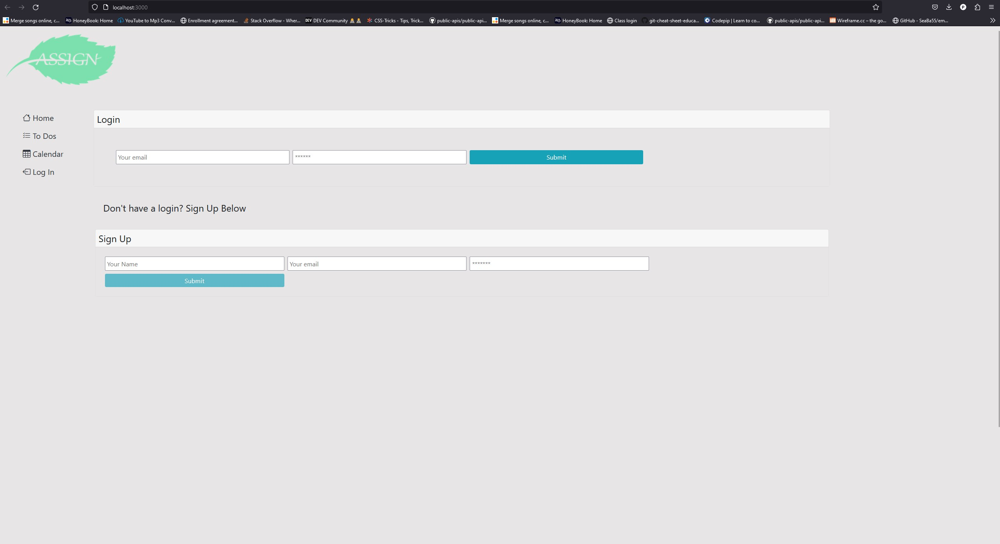
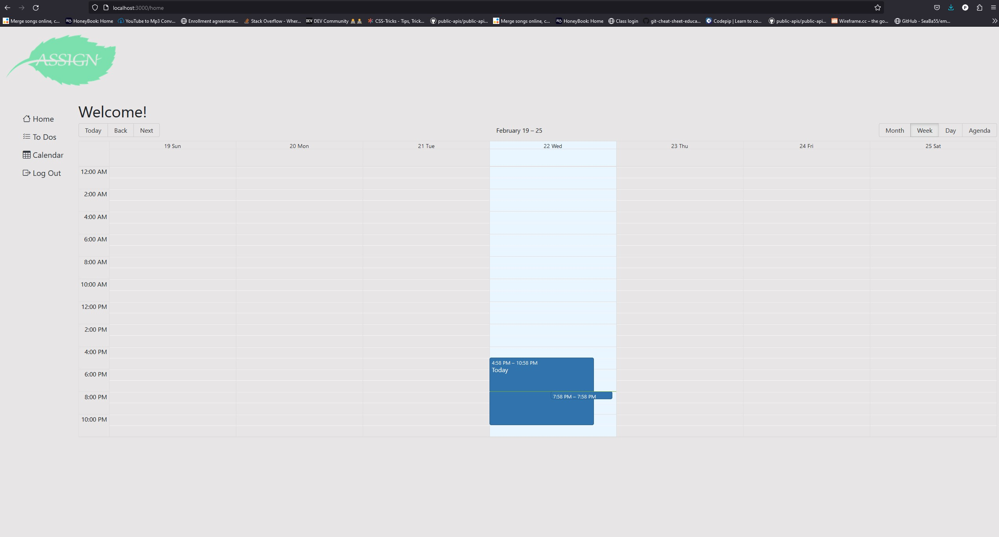
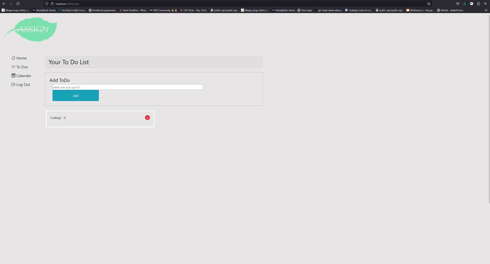

# Final Project: Assignmint

## Description
Assignmint is a simple task manager app that handles different types of daily tasks. From daily household tasks, grocery lists and daily/weekly/monthly event planning. Users can create their own logins and update, view, delete tasks as well as update profile information.

*Some features available in upcoming version 2.0*

A coark board background with the calander having animated functions like page turning. Also looking to add a functional meal/fitness tracker that can be updated daily.

## User Story

As a person with a busy life style from school to work and managing a business, I need to coordinate household needs among many other tasks such as homework and scheduling work appointments. I use Assignmint to help keep track and share events, see upcoming appointments and create/edit to-do lists.

## Website Link

Check it out!
[Assignmint](https://assignmint.herokuapp.com/)

## Screenshot
* Create an account, log in, explore the navigation bar and start getting organized with Assignmint!  

  

  

## Technologies

This app uses the following technologies: 

Node
GraphQL
React
Bootstrap
MongoDB
Apollo
bcrypt
BigCalender
Webtoken
Mongoose
Express

## Contributors:
Kao Nou, Shanice Zupan, Alan Martinez, James Andritsch, Lance Schroeder
